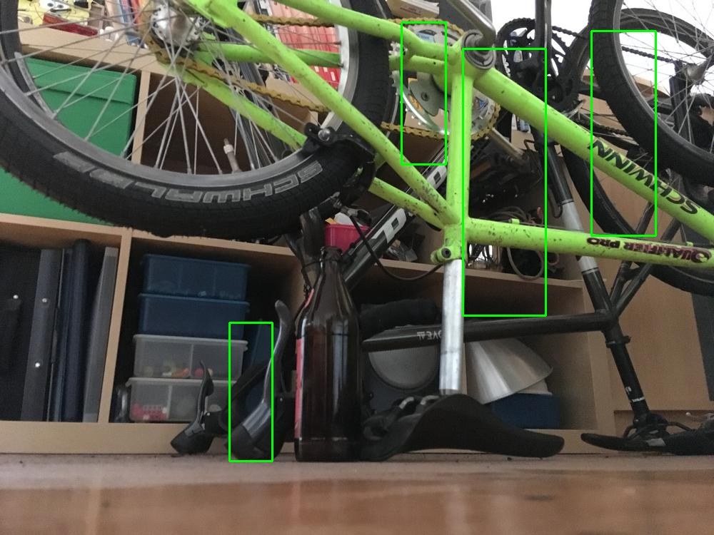
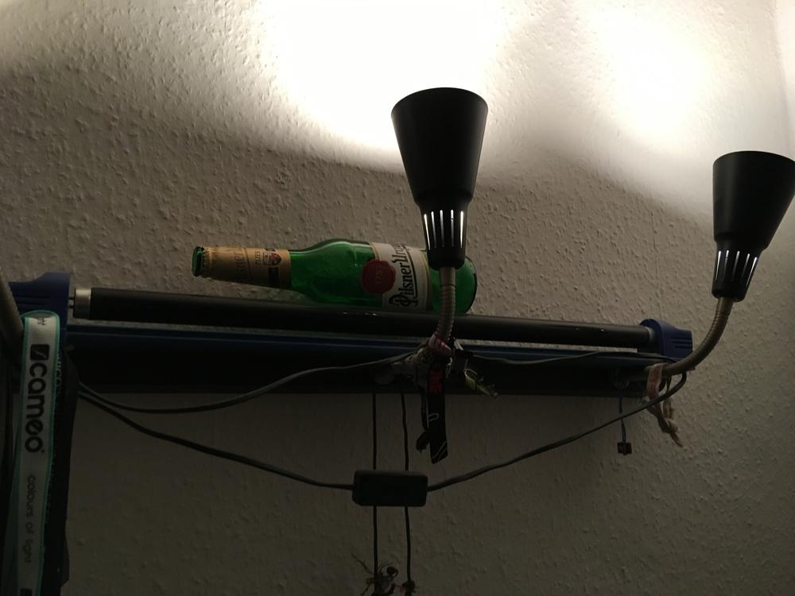
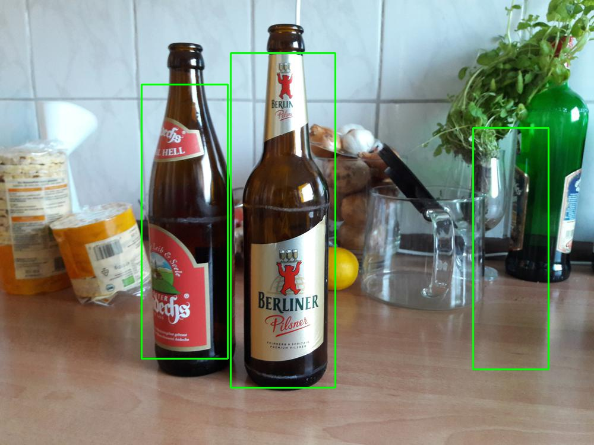
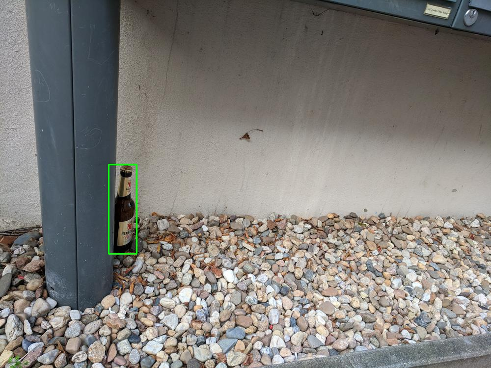
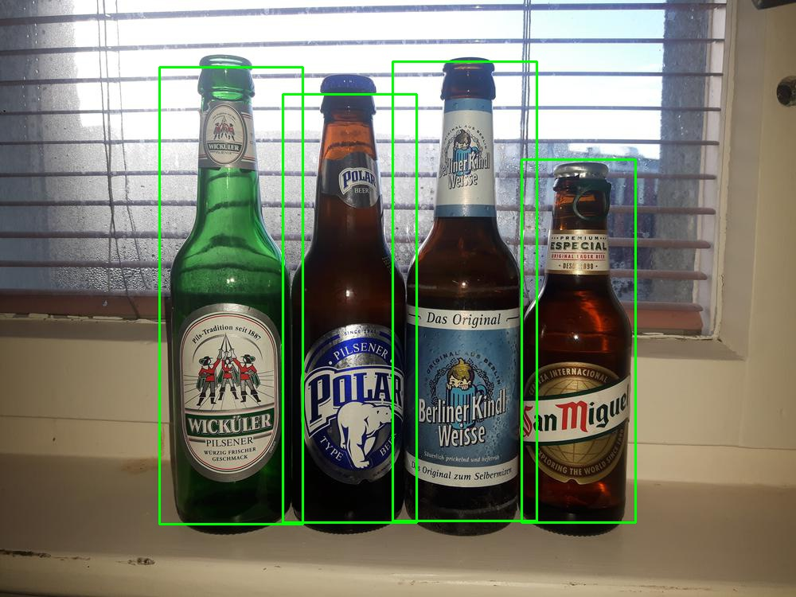
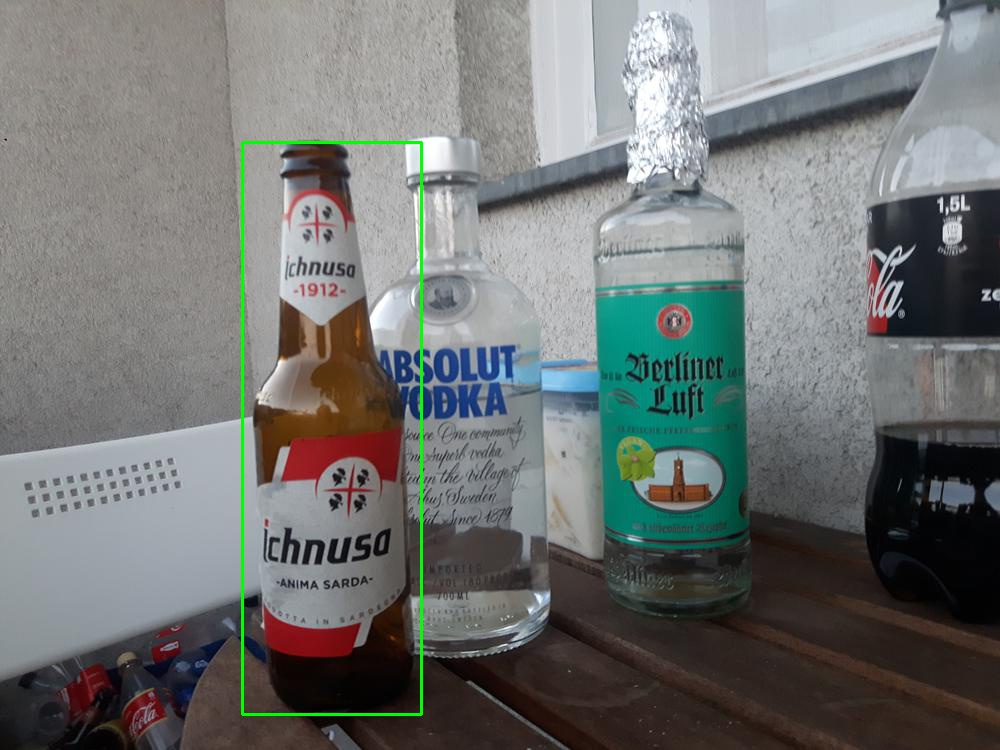
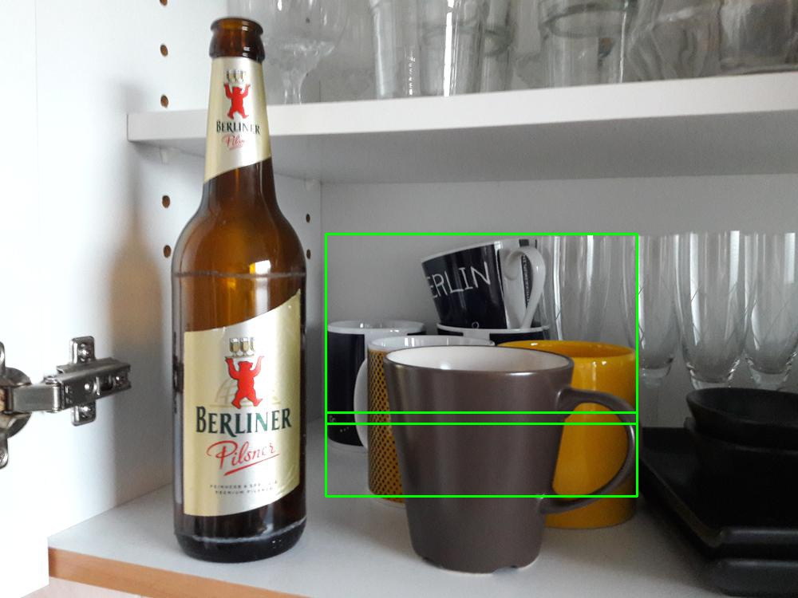
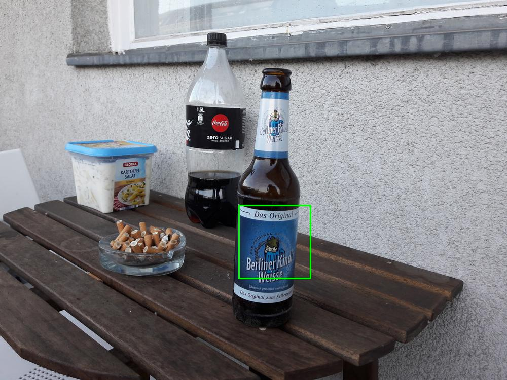
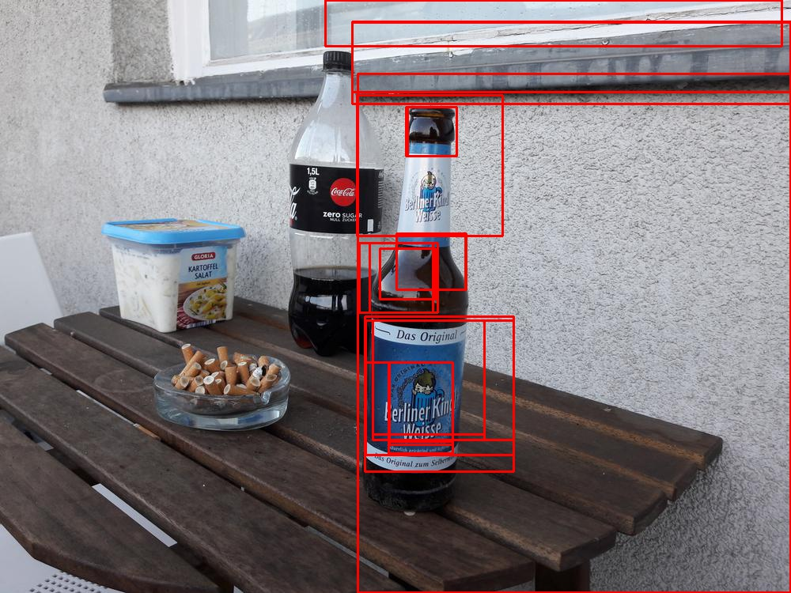

# Beer Bounding Box Detection
- Interactive Systems 2017
- Christopher Kümmel
- Robin Mehlitz
- Tom Oberhauser

## Problembeschreibung
Ziel dieses Projekts war es ein System zu implementieren welches auf gegebenen Bildern Bierflaschen erkennt. Hierbei können mehrere Bierflaschen, weitere nicht-Bierflaschen oder teilweise verdeckte Bierflaschen auf dem Bild zu sehen sein. Das System soll in der Lage sein diese zu Unterscheiden und darüber hinaus zu lokalisieren. Als Ergebnis werden Bounding Boxen um die klassifizierten Bierflaschen gezeichnet bzw. die zugehörigen Positionsdaten in einer externen Datei abgespeichert.
Um ein Bierflaschen Objekterkennungstool implementieren zu können, wurde zunächst ein grundlegender, annotierter Datensatz benötigt. Daher wurde in diesem Projekt ein Datensatz, der *BeerBB-1K*, erzeugt. Der Datensatz beinhaltet neben den Bildern einen Gold-Standard, welcher eine Evaluation der entstandenen Messergebnisse ermöglicht.
Für die Bierflaschen-Erkennung wurden zwei unabhängige Teilsysteme entwickelt: der erste basiert auf dem Viola and Jones Ansatz und verwendet die Implementierung von OpenCV. Im zweiten Ansatz wurde ein R-CNN implementiert.

## Umsetzung

### Datensatz BeerBB-1K

Zum Training und zur Evaluation unserer Ansätze benötigten wir einen Referenzdatensatz. Dieser soll die Idealpositionen von Bounding Boxen um die Bierflaschen eines Bildes beinhalten. Da wir keinen geeigneten Datensatz finden konnten, haben wir einen eigenen Datensatz erstellt. Dieser beinhaltet 1000 annotierte RGB Bilder im JPEG Format, in den Abmessungen 1000x750px. Die Bilder wurden alle mit Smartphones aufgenommen und variieren in ihrer Komplexität und Qualität. Dies entspricht den zu erwartenden Eingabebildern des Systems.

Der Datensatz steht unter [https://github.com/devfoo-one/BeerBB-1K](https://github.com/devfoo-one/BeerBB-1K) zur Verfügung.

#### Aufbau BeerBB-1K

Der Datensatz besteht aus 1000 Bildern und ihrer jeweiligen Beschreibungen als `.json` Datei.

- `0000.jpg` - `0999.jpg`
    - Bilder
- `0000.json` - `0999.json`
    - Enthält ein Array aus Bounding Boxen
        - `x` - X-Koordinate der oberen linken Ecke der Bounding Box
        - `y` - Y-Koordinate der oberen linken Ecke der Bounding Box
        - `w` - Breite der Bounding Box
        - `h` - Höhe der Bounding Box
        - `isOpen` - Status der Flasche (offen oder geschlossen)
        - `brand` - Bezeichnung der Biersorte

```json
[{
  "brand": "Berliner Kindl Pilsener",
  "h": 445,
  "isOpen": true,
  "w": 107,
  "x": 369,
  "y": 100
}, {
  "brand": "Radeberger Pilsner",
  "h": 625,
  "isOpen": false,
  "w": 151,
  "x": 422,
  "y": 58
}, {
  "brand": "Berliner Kindl Pilsener",
  "h": 629,
  "isOpen": false,
  "w": 169,
  "x": 582,
  "y": 75
}]
```

*Die Informationen `isOpen` sowie `brand` finden in unserer Arbeit keine Verwendung. Wir hielten es jedoch wichtig diese Informationen mit zu erfassen, da sie den Datensatz für weitere Vorhaben interessanter gestalten.*

#### Erstellung des Datensatzes

OpenCV stellt ein Annotationstool `opencv_annotation` zur Erstellung von Trainingsdaten zur Verfügung. Dieses Tool erfüllte jedoch nicht unsere Ansprüche an den Datensatz, da dieser noch mit zusätzlichen Informationen (`isOpen` sowie `brand`) angereichert werden sollte. Aus diesem Grund wurde ein eigenes Annotationstool mithilfe von Python implementiert, welches die Annotierung mit zusätzlichen Metainformationen erlaubt. Im Gegensatz zu `opencv_annotation` erstellt unser Annotator eine Metadatei pro Bild, was das Teilen des Datensatzes in Test- und Trainingspartitionen einfacher gestaltet.

### Viola-Jones

(Quellen: http://computervisionwithvaibhav.blogspot.de/2015/08/viola-jones-in-nut-shell.html, Robust Real-time Object Detection (2001) by Paul Viola and Michael Jones)

Der Viola-Jones Algorithmus gilt als erste Echtzeit Objekterkennungsmethode und wurde 2001 veröffentlicht. Der Ansatz ist vor allem für Gesichtserkennung geeignet und optimiert.
Da der Algorithmus auf Machine-Learning beruht, ist es jedoch möglich, die Erkennung auch auf andere Objekte zu trainieren. Aus diesem Grund trainieren wir auf diese Weise einen Klassifizierer für Bierflaschen.
Der Algorithmus kann in vier Stufen unterteilt werden:
1. Haar-like features 
2. Integral Image
3. Adaboost Algorithm
4. Cascade of classifiers

##### Haar-Features
Die Haar-Features (oder auch Haar-like Features) bilden das Grundgerüst der Objekterkennung im Viola-Jones Algorithmus. Sie bestehen aus benachbarten Rechtecken, die nach Helligkeit unterschieden werden. Besteht ein Feature beispielsweise aus zwei horizontal übereinander liegenden Rechtecken, so steht das eine für helle Pixel und das andere für dunkle. Diese Pixel werden pro Rechteck aufsummiert und dann zwischen den Rechtecken die Differenz gebildet. Diese wird mit einem Schwellwert verglichen, der während des Trainings errechnet wird. Passt das Feature in den Schwellenwert ist dies ein Indikator dafür, dass ein gesuchtes Objekt vorliegt.
Haar-Features sind schwache Indikatoren, da ein Merkmal alleine nicht ausreicht um ein Objekt als solches zu klassifizieren. Aus diesem Grund müssen sehr viele Haar-Features über ein Objekt gelegt werden, um eine aussagekräftige Erkennung zu erhalten. Für eine Gesichtserkennung werden über 160.000 Features ausgewählt (Quelle: https://docs.opencv.org/3.3.0/d7/d8b/tutorial_py_face_detection.html). Die als Merkmal erkannten Features werden nach dem Training extrahiert und auf neue Bilder angewendet, um dort Objekte zu erkennen.

##### Integralbild
Das aufsummieren der Pixel in einem Haar-Feature dauert für die Menge an zu berechnenden Features sehr lange. Für die verschiedenen Features werden oft gleiche Pixelsummen erneut gebildet. Mit Hilfe des Integralbildes können die Summenbildungen verkürzt und somit beschleunigt werden.
Das Originalbild ist ein Pixelraster. Dieses wird unterteilt in Rechtecke. Pro Rechteck gibt es dann ein Integralbild. Hierfür wird für jeden Pixel im originalen Rechteck eine Summe im Integralbild berechnet. Diese Summe ergibt sich aus allen Pixeln links vom Ausgangspixel und allen darüber liegenden Pixeln einschließlich des Ausgangspixels.
Diese Berechnung wird für jeden Pixel ausgeführt und das Ergebnis an die Stelle im Integralbild eingetragen. Auf diese Weise sind Flächen vorberechnet und es müssen beim Aufsummieren der Pixel in der Haar-Feature Berechnung weniger Pixel zusammengerechnet werden.

##### Adaboost Algorithmus
Wie bereits beschrieben, werden sehr viele Haar-Features für eine Objekterkennung berechnet. Da jedoch eine Echtzeiterkennung gewünscht ist, können sie nicht alle auf ein neues Objekt angewendet werden. Deshalb werden mit dem Adaboost Algorithmus nur die wichtigsten Features ausgewählt, die für die Erkennung am meisten Gewicht haben.
Dieser Machine-Learning Algorithmus wird beim Training angewendet. Zu Beginn erhalten alle Haar-Features dieselbe Gewichtung. Dann wird auf den Trainingsbildern anhand der Features ein Objekt gefunden. Der Algorithmus prüft jedes Feature, ob es geholfen hat, das Objekt als solches zu erkennen. Wenn das Feature relevant ist, wird das Gewicht erhöht, andernfalls wird es verringert. Dieser Schritt wird sehr oft wiederholt, bis irgendwann Features eine hohe Gewichtung besitzen und die anderen eine niedrige.
Alle relevanten Features ergeben in Kombination nun einen aussagekräftigen oder auch starken Klassifizierer.

##### Kaskade des Klassifizierers
Ein Klassifizierer enthält bestimmte gewichtete Features. Sie werden linear in einer Reihenfolge angewendet. Dieser Stufe des Algorithmus legt die Reihenfolge der Features fest, so dass am Ende eine Kaskade an kleinen Klassifizierern herauskommt.
Das zu prüfende Bild wird in Subbilder unterteilt. Um möglichst effizient das Objekt im Bild zu finden, muss pro Teilbild möglichst schnell die Entscheidung getroffen werden, ob der Abschnitt zum Objekt gehört oder nicht.
Dafür bilden die hintereinander geschalteten Features Stufen, die alle passiert werden müssen, damit ein Sub Bild als Objektregion erkannt wird. Das Teilbild wird in die Kaskade hineingegeben, woraufhin mit Hilfe des ersten Features/Klassifizierers entschieden wird, ob das Teilbild zum Objekt gehören könnte oder nicht. Gibt es negative Rückmeldung, wird die aktuelle Region verworfen und das nächste Teilbild geladen. Gibt es positives Feedback, wird das Subbild an die nächste Stufe des Klassifizierers übergeben. Nur wenn alle Stufen positive Rückmeldung geben, wird das Teilbild als Objektregion klassifiziert.
Am Anfang der Kaskade sollten also möglichst, einfache oder allgemeine Features stehen. So ist gegeben, dass möglichst schnell entschieden werden kann, ob die Region überhaupt von Interesse ist. Die komplexesten Features sollten am Ende der Kaskade stehen, da sie am rechenaufwändigsten sind.

#### Umsetzung mit der Opencv Implementierung
Für den Viola-Jones Ansatz gibt es eine Opencv Implementierung, auf die wir in unserem Projekt zurückgreifen. Um die Objekterkennung zu benutzen muss eine *cascade.xml* Datei existieren, die einen Klassifizierer enthält. Diese wird mit _Opencv_ geladen und auf einem Bild wird anschließend die Erkennung ausgeführt. Für Gesichter sind in _Opencv_ bereits Klassifizierer vorhanden. Für unsere Bierflaschen muss dieser erst erstellt werden. Dafür benutzen wir unseren Bierflaschen-Datensatz. Dabei werden 80% der Bilder für das Training und die restlichen 20% für die Evaluation benutzt.
Zunächst werden die Bounding Boxen sowie die Pfade zu den Bildern aus den Json-Dateien in eine Annotationsdatei zusammengefasst. Dies wird durch ein Python-Skript realisiert. Anschließend werden aus den Trainingsbildern, negative Samples erstellt. Jene sind die Hintergrundbilder, auf denen die Bierflaschen Bounding Box einfach übermalt wurde. Die negativen Samples werden ebenfalls in einer Datei zusammengefasst.
Aus der Annotationsdatei für die Bierflaschenbilder werden für das Training benötigte Samples generiert. Durch den Einsatz des Commandline-Tools *opencv_createsamples* erhalten wir aus unseren Bildern die gewünschte Anzahl an Samples in einer selbst angegebenen Größe. Diese positiven Samples liegen alle in einer *.vec* Datei.
Für das Training des Klassifizierers wird sowohl die Datei mit den positiven Samples als auch die mit den Negativen benötigt. Das Training wird mit Hilfe des Tools *opencv_traincascade* vollzogen. Für das Training müssen Parameter mitgegeben, die den Trainingsablauf bestimmen. Beispielsweise muss angegeben werden, wie viele Stages (numStages) trainiert werden sollen und mit wie vielen positiven und negativen Bildern (numPos, numNeg) pro Stage.
Nach dem Training erhalten wir die gewünschte Klassifizierer-Datei in *xml* Form, die wir anschließend benutzen können um Bierflaschen zu Erkennen.
Unser bestes Ergebnis erzielten wir mit folgenden Parametern:

* w, h = 30:96
* numPos = 400
* numNeg = 800
* numStages = 15
* minHitRate = 9.9500000476837158e-01
* maxFalseAlarm = 5.0000000000000000e-01
* weightTrimRate = 9.4999998807907104e-01
* maxDepth = 1
* maxWeakCount = 100
* maxCatCount = 0
* featSize = 1
* mode = ALL

Für die Bestimmung der Sample-Größe in Pixeln (w, h), lag die Schwierigkeit darin, zu entscheiden wie groß und in welchem Verhältnis die Samples gewählt werden sollten für das Training. Wir errechneten uns dafür den Durchschnittswert des Verhältnisses über alle Bounding Boxen aus unserem Datensatz. Als Ergebnis haben wir ein Verhältnis von _1:3.2_ erhalten, was erweitert die 30:96 Pixel ergab.
Entscheidend bei positiven und negativen Samples ist das Verhältnis zwischen ihnen. Hier ist es sinnvoll mehr negative Samples als Positive zu wählen. Da für das Training insgesamt 800 positive Samples zur Verfügung stehen, musste die Anzahl an Samples pro Stage geringer ausfallen, um nicht immer mit allen zu trainieren und möglichst viel Varianz hinein zu bekommen.
Da das Training sehr lange dauert, wurde eine Anzahl von 15 Stages gewählt. Das Training dauerte mit dieser Wahl bereits über 26 Stunden.
Beim Parameter _mode_ kann gewählt werden welche Menge an Haar-Features benutzt werden soll. Wir benutzten alle im Training.
Die restlichen Parameter entsprechen den Default-Werten von *Opencv*.

#### Evaluation Viola-Jones
Das Training liefert auf der Evaluationsmenge unseres Datensatzes ein halbwegs gutes Ergebnis mit den Scores:

|           | Viola and Jones |
|-----------|:---------------:|
| Precision |       0.572     |
| Recall    |       0.685     |
| F1        |       0.624     |


Dabei treten verschiedene Fehler bei den Voraussagen der Bounding Boxen auf.
Häufig wird eine Region falsch als Bierflasche erkannt wie hier zu sehen.



Dies passiert auch häufig bei anderen Flaschenarten, die ebenfalls dunkel oder grün sind.
Wenn Bierflaschen rotiert sind, also nicht Senkrecht stehen oder aus einem anderen Winkel fotografiert wurden, dann fällt es dem Klassifizierer ebenfalls schwer diese Flaschen zu erkennen.



Ein weiteres jedoch kleineres Manko ist, dass die Bierflaschen oft nur teilweise eingefasst werden und nicht komplett in der Box liegen.



Jedoch konnten auch gute Ergebnisse erzielt werden. Es wurden sowohl Bierflaschen komplett und in verschiedenen Größen erkannt, als auch von anderen Flaschenarten unterschieden (s. folgende Abbildungen). Auch mehrere Bierflaschen in einem Bild wurden gut erkannt.







Um das Model zu verbessern, gibt es mehrere mögliche Ansätze. Der Datensatz muss vergrößert und noch weiter variiert werden. Vor allem rotierte Bierflaschen in verschiedenen Positionen und Winkeln könnten weiterhelfen um liegende Flaschen zu erkennen. Ein weiteres Manko dieses Ansatzes ist, dass durch die feste Pixelgröße der Samples, die Bierflaschen teilweise verzerrt werden. Dadurch ist es möglich, dass einige Haar-Features nicht korrekt errechnet werden. Außerdem könnte es helfen mehr negative Samples zu erstellen, die auch viele verschiedene andere Flaschen- und Gefäßarten beinhalten.

Für das Training können die Parameter noch variiert werden und es könnten mehr Stages genutzt werden. Jedoch ist die _Opencv_ Dokumentation für die Parameter des Trainingstools zu kurz. Erklärungen wie sich die Parameter auf das Training auswirken, sind nahezu nicht vorhanden. Deshalb ist es schwierig gute Ergebnisse mit diesem Ansatz zu erzielen, da das Training sehr lange dauert und Ausprobieren somit einen langwierigen Prozess bedeutet. Die Objekterkennung ist quasi in Echtzeit, jedoch benötigt das Training dafür umso mehr Zeit.

### R-CNN

> **“...we combine region proposals with CNNs, we call our method R-CNN: Regions with CNN features.”** - Girshick, R., Donahue, J., Darrell, T., & Malik, J. (2014). Rich feature hierarchies for accurate object detection and semantic segmentation. In Proceedings of the IEEE conference on computer vision and pattern recognition (pp. 580-587).

Dieses Zitat aus der Veröffentlichung von \[GirshickEtAl2014\] die den Begriff *R-CNN* einführte beschreibt sehr gut den Aufbau eines R-CNN. Es besteht aus einer *Region Proposal* und einer CNN Komponente.

Sie verdeutlichen den Aufbau in folgender Abbildung:


Zunächst wird ein Eingabebild durch ein System in Regionen unterteilt. Hierzu verwenden sie den [Selective Search Algorithmus](https://ivi.fnwi.uva.nl/isis/publications/bibtexbrowser.php?key=UijlingsIJCV2013&bib=all.bib) \[UijlingsIJCV2013\]. Der Algorithmus unterteilt das Bild in etwa 2000 Regionen welche ein Objekt enthalten können.

Diese Regionen werden auf ein einheitliches Format (227x227px) reduziert um eine einheitliche Größe für ein CNN zu realisieren, welches zur Ermittlung von Features verwendet wird. Diese Features werden nun zur Klassifikation, im Falle von \[GirshickEtAl2014\] durch eine Support Vector Machine, des Bildes verwendet.

#### (hacky-DIY-not-so-fast) - R-CNN

Um die Funktionsweise eines R-CNN schrittweise nachvollziehen zu können entschieden wir uns dazu es selbst zu implementieren. Wir behielten die grobe Struktur bei, jedoch mussten wir an einigen Stellen Veränderungen vornehmen. Unser *(hacky-DIY-not-so-fast) - R-CNN* besteht aus den Komponenten

1. Region Proposal
2. Region Classification

auf deren Aufbau nun eingegangen wird.

##### 1. Region Proposal

Der von \[GirshickEtAl2014\] verwendete [Selective Search Algorithmus](https://ivi.fnwi.uva.nl/isis/publications/bibtexbrowser.php?key=UijlingsIJCV2013&bib=all.bib) von \[UijlingsIJCV2013\] benötigt MATLAB. Aus diesem Grund entschieden wir uns für die Verwendung des alternativen Selective Search Ansatzes von [https://github.com/AlpacaDB/selectivesearch](https://github.com/AlpacaDB/selectivesearch).

##### 2. Region Classification

Im Gegensatz zu \[GirshickEtAl2014\] verwenden wir ein und das selbe CNN zur Erzeugung der Features und zur Klassifikation der Bildregionen. Es finden hierzu zwei Netzarchitekturen für unterschiedliche Eingabeformate Verwendung.

Eingabeformat 50x50px RGB:

```python
model = Sequential()  
model.add(Conv2D(filters=32, kernel_size=(3, 3), activation='relu', padding='same', input_shape=(50, 50, 3)))  
model.add(Conv2D(filters=32, kernel_size=1, activation='relu'))  
model.add(MaxPooling2D((2, 2)))  
model.add(Dropout(0.25))  
model.add(Conv2D(filters=64, kernel_size=(3, 3), activation='relu', padding='same'))  
model.add(Conv2D(filters=64, kernel_size=1, activation='relu'))  
model.add(MaxPooling2D((2, 2)))  
model.add(Dropout(0.25))  
model.add(Flatten())  
model.add(Dense(units=512, activation='relu'))  
model.add(Dense(units=2, activation='softmax'))  
model.compile(loss='categorical_crossentropy', optimizer='adam', metrics=\['accuracy'\])
```

Eingabeformat 200x200px RGB:

```python
model = Sequential()  
model.add(Conv2D(filters=32, kernel_size=(3, 3), activation='relu', padding='same', input_shape=(200, 200, 3)))  
model.add(Conv2D(filters=32, kernel_size=1, activation='relu'))  
model.add(MaxPooling2D((2, 2)))  
model.add(Dropout(0.25))  
model.add(Conv2D(filters=64, kernel_size=(3, 3), activation='relu', padding='same'))  
model.add(Conv2D(filters=64, kernel_size=1, activation='relu'))  
model.add(MaxPooling2D((2, 2)))  
model.add(Dropout(0.25))  
model.add(Conv2D(filters=64, kernel_size=(3, 3), activation='relu', padding='same'))  
model.add(Conv2D(filters=64, kernel_size=1, activation='relu'))  
model.add(MaxPooling2D((2, 2)))  
model.add(Dropout(0.25))  
model.add(Flatten())  
model.add(Dense(units=1024, activation='relu'))  
model.add(Dense(units=2, activation='softmax'))  
model.compile(loss='categorical_crossentropy', optimizer='adam', metrics=\['accuracy'\])
```

##### Training des R-CNN

Zum Training wurde der Datensatz *BeerBB-1K* verwendet. Von diesem wurden 80% zum Trainieren, und 20% zum Evaluieren verwendet.

Aus dem Trainingsbild wurde zunächst die markierte Bierflasche anhand der Bounding Box entnommen. Dieses Teilbild wurde dann auf das entsprechende Eingabeformat des CNN (50px² bzw. 200px²) transformiert und in vier Orientierungsvarianten (0°, 90°, 180° und 270°) als positives Trainingsample gespeichert. Der Bereich der Bierflasche auf dem Trainingsbild wurde anschließend durch ein schwarzes Rechteck ersetzt.

Auf dem verbleibenden Bild wurde nun der Selective Search Algorithmus mit den Parametern

- `scale` = 500
- `sigma` = 0.8
- `min_size` = 100

zur Bildsegmentierung angewendet. Die resultierenden Segmente wurden als negatives Trainingssample gespeichert.

Durch dieses Verfahren konnten aus den 800 annotierten Trainingsbildern

- 3764 positive Trainingssamples (941 Flaschen * 4)
- 262553 negative Trainingssamples

gewonnen werden.

Es wurden 3 verschiedene Kombinationen aus Trainingsmengen und CNN trainiert und evaluiert:

-   **CNN1 (voller Trainingsdatensatz)**
    -   3764 positive Samples
    -   262553 negative Samples
    -   Eingabegröße 50px²
-   **CNN2 (kleiner Datensatz)**
    -   *bessere Balance zwischen negativen und positiven Samples*
    -   3764 positive Samples
    -   3712 negative Samples
    -   Eingabegröße 50px²
-   **CNN3 (großer Input-Layer)**
    -   *größere Eingabeschicht*
    -   3764 positive Samples
    -   8000 negative Samples
    -   Eingabegröße 200px²

##### Evaluation des R-CNN

Alle 3 Ansätze wurden in Hinblick auf Precision, Recall und F1 Wert evaluiert (Details zur Ermittlung dieser Werte finden sich im nächsten Abschnitt).

In der folgenden Tabelle werden die quantitativen Messwerte pro System angegeben. Die Zahl `p` entspricht hierbei dem Schwellwert für die Positiverkennung an der letzten Softmax-Schicht.

|           | CNN1 | CNN2 p=0,99 | CNN3 p=0,50 | CNN3 p=0,95 | CNN3 p=0,99 |
|-----------|:----:|:-----------:|:-----------:|:-----------:|:-----------:|
| Precision |   -  |     0,16    |     0,13    |     0,18    |     0,19    |
| Recall    |   -  |     0,44    |     0,37    |     0,35    |     0,31    |
| F1        |   -  |     0,23    |     0,19    |     0,23    |     0,23    |


##### Beobachtungen und Diskussion

Das System *CNN1* lieferte in keiner Kombination Ergebnisse. Es wird vermutet, dass dies mit dem starken Overfitting auf negativen Samples zusammenhängt.

Die Systeme *CNN2* sowie *CNN3* lieferten Ergebnisse. Eine Steigerung des Schwellwertes `p` an der Ausgabeschicht führte erwartungsgemäß zur Erhöhung der Precision und zum Abfall des Recall. Im Gegensatz zu *CNN2* liefert *CNN3* bei gleicher Konfiguration (`p=0.99`) eine geringfügig höhere Precision, jedoch geringeren Recall. Diese Steigerung rechtfertigt in keiner Weise die erhöhten Anforderungen (470MB statt 55MB Modellgröße sowie ca. 2min Dauer der Klassifikation), zumal der F1 Wert vergleichbar ist.

Interessant hierbei ist, dass die CNN während des Trainings Validierungsgenauigkeiten im 0,9* Bereich aufwiesen. Dies deutete darauf hin, dass die Regionen Vorschläge scheinbar nicht von zufriedenstellender Qualität gewesen sein mussten.

Qualitativ lassen sich die möglichen Fehler somit in zwei Kategorien einteilen:

1. Fehlerhafte Klassifikation einer Region
   - Eine Region, welche keine Bierflasche enthält wird als Bierflasche klassifiziert
2. Fehlerhafter Regionen Vorschlag
   - Eine Bierflasche ist nur teilweise Teil der Region
   - Eine Region ist wesentlich größer und beinhaltet die Bierflasche

In diesem Beispiel wurde eine Region welche Tassen enthält klar falsch als Flaschen klassifiziert:



Im nächsten Beispiel wurde die Bierflasche erkannt, die Region ist jedoch viel zu klein. Es wird vermutet, dass hier das Logo erkannt wurde.



Eine Auswertung der durch den Selective Search Algorithmus ermittelten Regionen Vorschläge zeigte, dass keine zusammenhängende und gut passende Region um die komplette Bierflasche gefunden wurde.



##### Fazit (hacky-DIY-not-so-fast) - R-CNN

Es wurde festgestellt, dass der initiale Bildsegmentierungsschritt essentiell für die nachfolgende Klassifikation ist. In der hier implementierten Lösung ist diese Segmentierung der Flaschenhals und kostet in der Anwendung viel Zeit.
Die Anzahl an falsch klassifizierten Regionen lässt jedoch ebenfalls auf ein zu schlechtes CNN schließen. Es wird vermutet, dass mehr Trainingsdaten aus unterschiedlichen Quellen (z.B. [ImageNet](http://www.image-net.org/)) zu besseren Ergebnissen führen.

Abschließend möchten wir festhalten, dass sich die DIY-Implementierung eines solchen Systems sehr gut zum Verständnis der Funktionsweise und der Fehlerquellen eignet. Für den Produktiveinsatz würden wir jedoch auf bestehende Lösungen wie z.B. [YOLO](https://pjreddie.com/darknet/yolo/) oder [Detectron](https://github.com/facebookresearch/Detectron) zurückgreifen und diese entsprechend unseren Anforderungen trainieren.

## Evaluation

### Intersection over Union
Für die Evaluation unserer Systeme verwenden wir den Intersection over Union (auch Jaccard-Koeffizient genannt) Ansatz. Dieser ermöglicht, durch die Division der Schnittmenge zweier Flächen mit der Vereinigungsmenge dieser, einen Koeffizienten zur Bewertung der Bounding Box zu berechnen. Der Ansatz findet in vielen Systemen seine Verwendung. Ein großer Vorteil dieses ist es, dass er unabhängig von dem System zur Klassifizierung ist. Es werden lediglich die Positionswerte der Bounding Boxen benötigt.

Für die Berechnung in unserem System wird die Gold Bounding Box mit der Predict Bounding Box verglichen und der Koeffizient gebildet. Hierbei unterscheiden wir das Resultat in drei verschiedene Klassen:
1. IoU > 0.5
2. IoU < 0.5 && IoU > 0.0
3. IoU == 0

Die erste Klasse repäsentiert einen guten, die zweite einen schlechten und die dritte Klasse keinen Match. Diese Einteilung dient als Hilfe für das Einordnen der Performanz des Systems. Darüber hinaus wird für jede Prediction in allen Bildern der Koeffizient aufsummiert um somit eine Aussage über das Modell treffen zu können.
Da in unserem Fall mehrere Bierflaschen in einem Bild und somit mehrere Gold-Annotationen sein können, haben wir einen einfachen Algorithmus implementiert, welcher die Distanz zweier Bounding Boxen zueinander berechnet. Somit kann das Evaluationstool für die Predict-Annotation die zugehörige Gold-Annotation, mit der kürzesten Distanz, zuordnen. Dies ist für die Evaluation wichtig, da sonst Predict-Annotationen mit mehreren Gold-Annotationen verglichen würden und somit den allgemeinen Koeffizienten des Modells verzerren.

### Precision, Recall und F1
Während der IoU-Koeffizient die Qualität der gefundenen Bounding Boxen beschreibt, eignen sich *precision*, *recall* sowie *F1* Werte um die Performanz des Systems zu bestimmen. Auf Basis der IoU-Koeffizienten ist es möglich diese für das Systems zu ermitteln. Wir definieren die notwendigen Werte wie folgt:
* true positives = Anzahl der gefundenen Predict-Annotationen, welche eine Gold-Annotation repräsentieren (IoU > 0.5)
* false positives = Anzahl der gefundenen Predict-Annotationen, welche keine Gold-Annotation repräsentieren (IoU < 0.5)
* false negatives = Anzahl der Gold-Annotationen, welche nicht durch eine Pred-Annotation repräsentiert werden


## Fazit

In diesem Projekt haben wir einen Bierflaschen-Datensatz bestehend aus 1000 Bildern und den dazugehörigen Annotationsdateien erstellt.
Es wurden zwei Ansätze zur Objekterkennung verfolgt, die auf den Datensatz der Bierflaschen angewendet wurden. Mit dem Viola-Jones Ansatz wurde ein relativ gutes Ergebnis mit einem F1-Score = 0.62 erzielt. Das Training dauerte jedoch sehr lange und liegt mit über 26 Stunden in einem unkomfortablen Bereich. Jedoch ließe sich das auf einer besseren Hardware sicherlich noch steigern.
Das R-CNN benötigte hohen Implementierungsaufwand und lieferte ein verbesserungswürdiges Ergebnis. Gründe hierfür sind zum einen die ungenügende Anzahl an Trainingsdaten und zum anderen die Qualität der Regionen Vorschläge.

## Quellen

- **\[GirshickEtAl2014\]** - Girshick, R., Donahue, J., Darrell, T., & Malik, J. (2014). Rich feature hierarchies for accurate object detection and semantic segmentation. In Proceedings of the IEEE conference on computer vision and pattern recognition (pp. 580-587).
- **\[UijlingsIJCV2013\]** - Uijlings, J. R., Van De Sande, K. E., Gevers, T., & Smeulders, A. W. (2013). Selective search for object recognition. International journal of computer vision, 104(2), 154-171.
